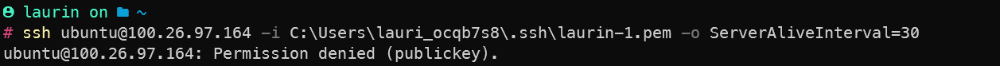

# Lab 4.1 - EC2

## HTML-Seite, inkl. URL

## Liste der EC2-Instanzen

## Details der Web Server-Instanz (öffentliche IP sichtbar)

## Security-Group: Liste der Inbound-Regeln.

# Lab 4.2 - S3

## Liste der Buckets.

## HTML-Seite, inkl. URL

## Liste der Dateien im Bucket.

## Eigenschaften von "Static website hosting".

# Zugriff mit SSH-Key

# Cloud-init Datei Verstehen

