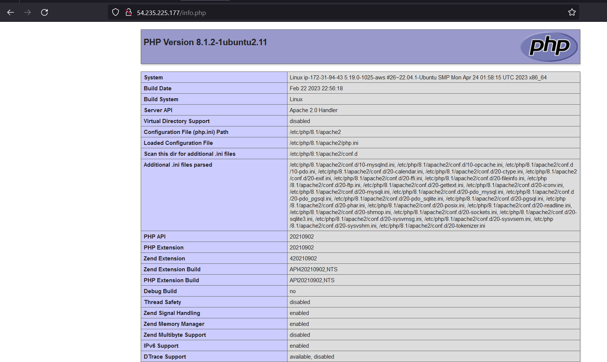
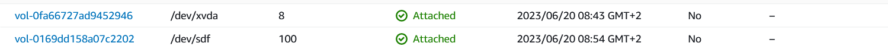

# KN03: Cloud-init und AWS / Storage
## Auftrennung von Web- und Datenbankserver
### Beweisführung DB Server

### Beweisführung Webserver

---
## Speicher
### Welchem Speichermodell wird S3 zugeordnet? Begründen Sie ihre Antwort. 
Ich denke der S3 Speicher ist kein spezifischer Hot Storage-, Warm Storage- oder Cold Storage-Dienst, sondern ein allgemeiner Speicherdienst, der je nach Konfiguration und Nutzung für verschiedene Speicheranforderungen angepasst werden kann.
### EC-2 Instanz

- Löschen Sie die Instanz. Lesen Sie zuerst die Bestätigungsmeldung durch und geben Sie in eigenenWorten wieder was in der Meldung erklärt wird.
	- Ich hatte keine Bestätigungsmeldung
- Erklären Sie wieso noch ein Volumen existiert. Machen Sie ein Gedankenexperiment und erklären Sieein Szenario in dem dieses Verhalten Sinn ergibt in ein paar schlüssigen Sätzen.
	- Ein EBS-Speicher bleibt auch nach dem Löschen der Instanz aus Gründen der Datensicherheit und -integrität bestehen. Dadurch können wichtige Daten auf dem Volume weiterhin genutzt werden, ohne sie versehentlich zu verlieren. Zudem ermöglicht es eine effizientere Ressourcennutzung, da das Volume für zukünftige Verwendungszwecke aufbewahrt werden kann. Ein separates Lebenszyklus von Instanzen und Volumes erlaubt es, Daten und Einstellungen über Instanzen hinweg beizubehalten und gleichzeitig die Instanzen flexibel zu verwalten. 