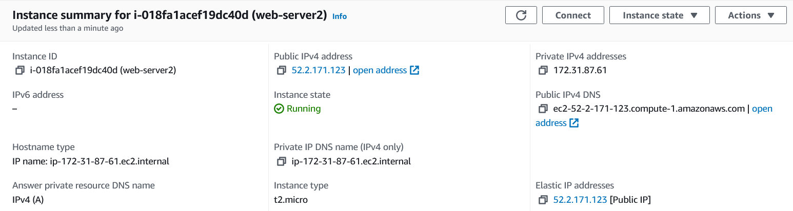

## Subnetz: Screenshot und Begleittext. Zeigen Sie, dass Sie das neue Subnetz erstellt haben.

Dies ist ein neues Subnetz welches von 172.31.100.0 - 172.31.100.255 reicht. Das Subnetz benannte ich "subnet-K04".

## Elastic IPs: Screenshot der Liste.

## Security Groups. Screenshot und Begleittext. Zeigen Sie die Inbound-Rules und die Namen der Security-Groups.

Ich erstellte zwei Security Groups. Eine für den Web Server namens "WebServer" und die ander für den Datenbank Server namens "DB-Server".

### Web-Server

### DB-Server

## Netzwerk-Interfaces: Screenshots und Begleittext. Zeigen Sie die private und öffentliche IP und diezugewiesene Security-Gruppe

## Laden Sie die aktualisierten Cloud-init Konfigurationen hoch in Git. Im Web-Konfig, sollte die IP angepasst sein.

## Erstellung der Instanz. Zeigen Sie die Details der beiden Instanzen, im speziellen die öffentliche undprivate IPs müssen sichtbar sein.

## Zeigen Sie, dass Sie nun alle drei Seiten aufrufen können (index.html, info.php und db.php).

